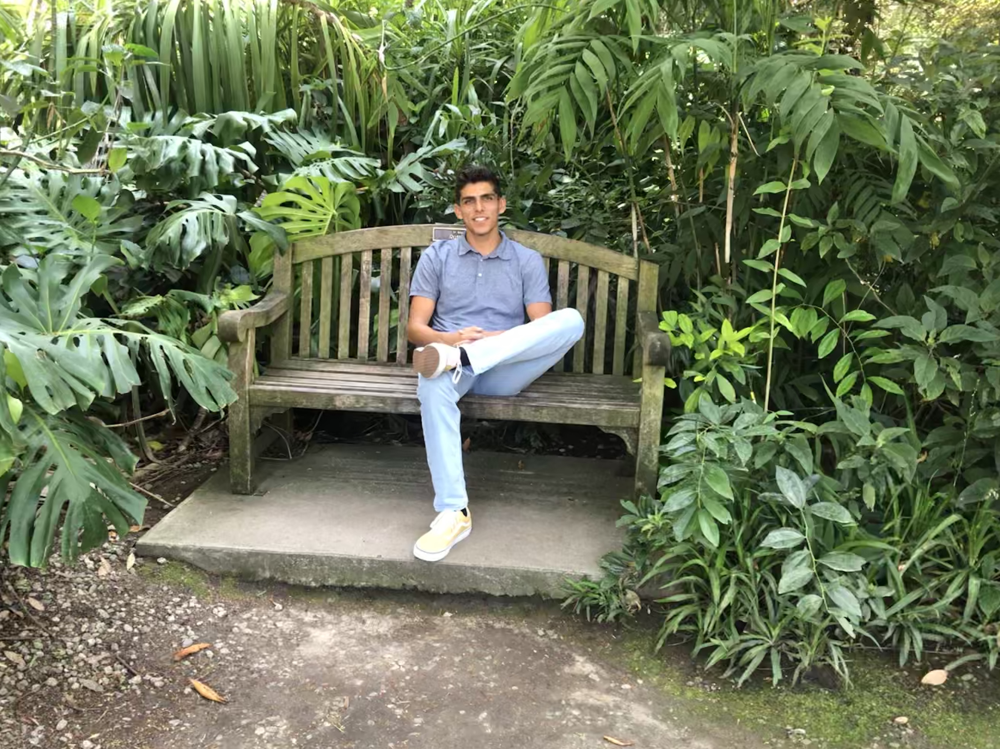

#  Steven's UX Portfolio
 |Introduction |   Me
 | ----------- | ----------------
 | - Hey my name is Steven Mendez, I am Mexican Colombian and I am in my last year of co    llege. Ive been with Liatrio for 6 weeks, and I am loving every moment of it. Something     cool about me is that I lived in Mexico for over 12 years.    |   |

| Hobbies     |  Favorite Foods
| ----------- | ----------------
| Swimming    |  Huevos Rancheros
| Fishing     | Chile Rellenos
| Playing video games | Paneer Tikka Massala
| Taking road trips |  Dosa
|skate Boarding | IN N OUT
|Snowboarding | CAVA
|surfing | Avocado Toast
## UX Team Project

## UX Journal

[Read about my experience with Bash](j01/)
