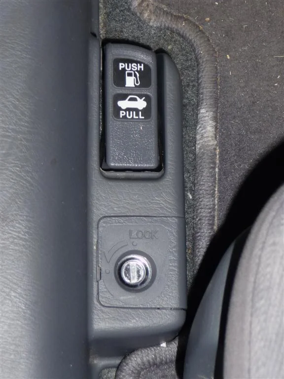
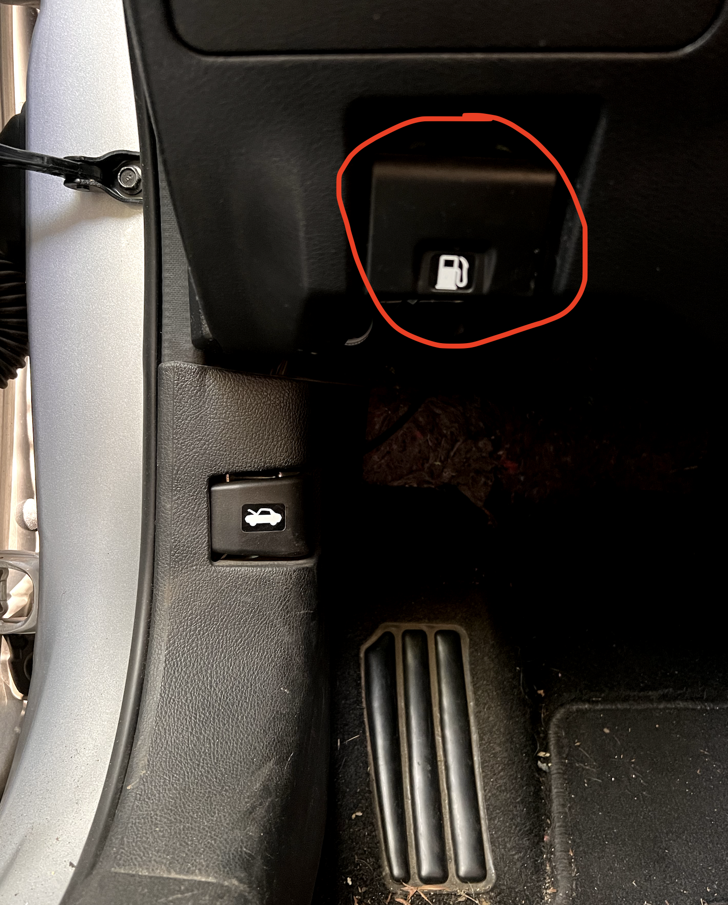

### Steven Mendez
### CSCI 431W
### Oct. 8th 2022

# Nissan Altima 2019 gas cap inconvenience

Let's begin by giving some examples of what a major inconvenience can be like, for example  a roommate not lowering the toilet seat after going to the bathroom, or not cleaning after themselves, these examples would be a major inconvenience that perhaps one would not like to live through, This is nothing like a minor inconvenience, personally, a minor inconvenience is something that doesn't work as expected but it is  also not a deal breaker. It is an issue that doesn't have much significance in someone's life but something that is noticed. Alright now that we got the major and minor inconveniences covered let's talk about my minor inconvenience. At one point in our lives everyone has pumped gas before. Let me ask you this question, what steps do you take to pump gas from start to finish. Some of you may have started off the scenario by first pulling the lever right underneath the seat on the left hand side. Just like the picture Below

Others may have first started by pushing on the gas cover like a european vehicle for example volkswagen, BMW … but if you have a Nissan Altima you may follow a different step then the ones discussed above. Now Nissan Altimas are very popular cars, they are reliable, and some would even say you get bang for your buck, and I agree with them, they are really great cars. My girlfriend happens to have a 2019 Nissan Altima, and I remember my first experience pumping gas like it was yesterday. Here are the steps
1. Reach for the lever beneath the seat just to the left.
- I realize there is no lever
2. My next thought is to look at the controls next to the steering wheel.  you know because it's a new car …
- NOT here either
3. Get out, walk around the car and push the gas cap, like in a VW ( my car ) 
- Nope not successful 
4. So I walk back over and start looking and I see the gas logo on a lever beneath the steering wheel to the left

Like this picture (Nissan Altima 2019)

Now at this point I'm not really aware that it's a minor inconvenience, so I finish pumping the gas and go on my way. However, Fast forward a couple hundred miles after driving around town we have to pump gas again, this time I remember that the gas lever is under the steering wheel to the left, and without looking I am feeling around for the lever. It just so happens there is another lever just to the left of the gas release lever and it also happens to be the hood release lever, me not knowing at the time I pull the lever out and try to pump gas and the cap isn't open. But the hood is … So I go to close the hood and then pull the gas lever.

till this day I still make the same mistake because my Natural Mapping is that the lever underneath the wheel is supposed to be the hood release lever as in numerous other cars. I could see if Nissan decided to change the location of the gas release lever they would've done it in a different way where it doesn't interrupt the natural mapping of where the hood release lever is supposed to be. I'm sure other people feel the same way. Now I say minor inconvenience because the car is still a really good car, and this isn't such a big inconvenience to steer buyers away from this particular model. Unlike maserati using cheap interior dodge parts in their 80,000 dollar luxury sedan (maserati ghibli)  now I won't go into a tangent of how wrong it seems to me. 

So thank you for making it to the end of my rant about my minor inconvenience. 

- Steven
